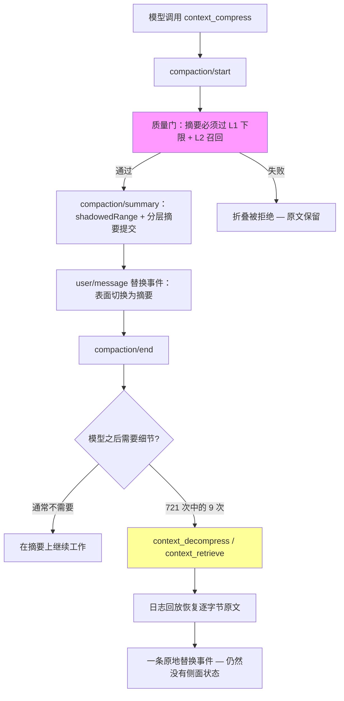

# dsh-asc

[](https://www.npmjs.com/package/@internetnutzer/dsh-asc)
[](https://github.com/JanEickholt/dsh-asc/releases)
[](LICENSE)

[English](./README.md) | [中文](./README.zh.md)

**dsh-asc**（全名 **DeepSeek Harness Agentic Surface Compaction**）是
[DeepSeek Harness](https://github.com/deepseek-ai/deepseek-harness) 的上下文压缩插件：由**模型自己决定何时压缩、压缩什么**，每个压缩决策都以持久化会话日志替换事件（`surfaceOp: replace`）提交，可回放、可检索、可撤销。

灵感来自 [opencode-acp](https://github.com/ranxianglei/opencode-acp) 的"模型自主压缩"哲学，但建在 DSH 事件溯源日志之上——压缩不产生任何侧面状态文件，解压靠日志回放，搜索覆盖包括压缩原文在内的全量日志。

## 安装

**前置要求**：已安装 [DeepSeek Harness](https://github.com/deepseek-ai/deepseek-harness)（`dsh` 命令可用）；Node.js `^22.19` 或 `>=24`。

**从 npm 安装**（推荐）：

```sh
dsh plugin --profile <name> add @internetnutzer/dsh-asc
```

**从 GitHub 安装**——想用比 npm 版本更新的提交：

```sh
dsh plugin --profile <name> add github:JanEickholt/dsh-asc
```

`dsh plugin` 会把插件加入 profile，并根据包内的 `dsh.bundle` 声明自动启用它；工具和系统提示随该 profile 一起加载。

> **重启生效**：安装完成后，重启正在运行的 DeepSeek Harness 服务。

### 其他安装方式

**从源码安装**——要改插件本身，或参与开发：

```sh
git clone https://github.com/lmst2/dsh-asc.git
cd dsh-asc
pnpm install
pnpm build
dsh plugin --profile <name> add "link:$(pwd)"
```

### 禁用 basic 后端

`ctx.compaction` 同一时刻只能有一个提供者。在 profile 自己的 `cordis.patch.yml` 里禁用默认的 basic 后端：

```yaml
- id: compaction-basic
  disabled: true
```

可选：挂载不变式伴生和全文检索后端：

```yaml
- insert:
    - id: dsh-asc-invariant          # 运行时不变式检查（可选，推荐）
      name: "dsh-asc/invariant"
    - id: session-query-sqlite       # context_search 全文检索后端（可选）
      name: "@deepseek-ai/dsh-session-query-sqlite"
```

## 使用

安装并重启后，无需任何配置——插件会：

- 在系统提示中注入**上下文管理规范**（判断规则、工具用法、分层压缩节奏），模型从第一轮起就主动管理上下文；
- 在上下文偏高时按需注入 **nudge 提示**（节奏门控；迭代类 nudge 还要求真实 token 增长，不会每轮打扰）；
- 在溢出或手动压缩时走**确定性降级**（LLM 摘要；挂载可选的上游工具结果修剪器时先修剪），无需模型配合。

插件提供六个模型工具：

| 工具 | 作用 |
|---|---|
| `context_status` | 上下文用量、分层检查点、系统/对话构成、推荐压缩区间、近期表面节点 |
| `context_compress` | 把一段表面范围替换成你写的检查点（支持批量；自动扩展工具调用对；质量门把关） |
| `context_decompress` | 撤销压缩：原文回到表面中检查点原位置（层级感知，`full: true` 到原始内容） |
| `context_recap` | 重新读取检查点摘要，不解压原文 |
| `context_search` | 全量日志全文检索（含已压缩内容） |
| `context_retrieve` | 按 24 位十六进制 sha-256 哈希或 seq 字节级原样返回被投影的工具结果原文 |

压缩后的内容永不丢失：原文保留在会话日志里，随时可解压或检索。

### 可逆的工具结果投影

与模型驱动的压缩分开，一个可选的投影服务在超大工具结果进入上下文**之前**
就压缩它们。它监听 `tools/post-execute` waterfall，用真实的 token 计量服务
测每个候选文本块，并且原样返回 waterfall 决策——原始事件先落日志。随后一
次可逆提交 shadow 原文并追加替换内容，替换内容里嵌有检索标记：

```
[dsh-asc projection: structured:json compressed 4200→312 tokens. Full
original (seq 57, stored in this session log): context_retrieve(hash="…").]
```

- 原文按字节原样留在会话日志里（单一事实来源，无侧面存储），重启后仍在；
  只有原文已持久落日志时才发出标记——标记永不悬空。
- 压缩器按内容分派：JSON/YAML/XML/分隔文本/代码的结构化探索器、git diff
  hunk 压缩、搜索结果裁剪、CLI 规则压缩，最后的兜底是按计量定价的首尾切片。
  `context_retrieve` 按哈希或 seq 返回字节级原文；未知键返回诊断字符串，
  绝不编造内容。
- 投影挂载为独立的 cordis 服务行，与 `ctx.compaction` 无关——关闭投影
  不会关闭压缩，溢出触发的工具结果修剪器仍作为兜底保留。
- 配置：`projection.enabled`（默认 `true`）、`projection.thresholdTokens`
  （默认 `1000`）。

系统提示词把这些工具串成一条操作闭环：把已经消费的原始工作压成 T1
检查点，把稳定下来的 T1 堆蒸馏成 T2 决策、再把 T2 堆凝结成 T3 事实索引。
每个检查点正文都带有 topic 和 Compaction id：可见摘要已经指出细节在哪
一块时，模型直接按 id 解压那一块；只有没有任何可见摘要能说明细节位置
时才用 `context_search`，而解压始终逐层进行。

## 工作原理

- **事件溯源**：压缩 = 日志里的一个事务（`compaction/start` → `compaction/summary` → 替换 `user/message` → `compaction/end`），无侧面状态。
- **分层压缩**：检查点分 tier（T1 全细节 → T2 决策蒸馏 → T3 裸事实），摘要越用越薄。
- **可逆**：解压回放日志中被 shadow 的事件，并提交一条原地替换事件；不需要任何侧面状态。
- **可审计**：谁压的、压了什么、摘要全文、token 成本都在日志里。

## 仓库结构

```
src/
  index.ts      插件入口：注册 ctx.compaction 与六个工具
  config.ts     严格配置校验
  types.ts      共享配置与结果类型
  events.ts     会话事件词汇说明（不声明自定义成员）
  invariant.ts  运行时不变式伴生（子路径导出）
  engine/       压缩引擎核心（engine、region、tier、quality-gate、fallback、prompt、restore）
  policy/       受保护节点策略与 nudge 状态机
  tools/        六个模型工具
  projection/   可逆工具结果投影服务与压缩器
  analytics/    会话日志用量扫描、regret 信号、asc-stats 命令
  utils/        共享文本工具
tests/          vitest 测试套件
scripts/        corpus-stats 与 bili-cache-join 测量脚本
docs/           usage、design、analysis、e2e-validation、cache-join
```

## 搭配官方 tool-result pruner 使用

dsh-asc 的目标是执行后**可逆**的工具结果压缩：每次投影保留 `context_retrieve`
查找表，原始内容随时可恢复。官方的
[`@deepseek-ai/dsh-compaction-tool-result-pruner`](https://github.com/deepseek-ai/deepseek-harness)
（dsh-compaction 补丁集里的工具剪裁补丁）则作为最后一道溢出防线：请求仍
溢出上下文窗口时，它把过大的工具结果截断为 head + tail，让本轮对话存活。

建议两者都安装：

- **dsh-asc 投影** — 主路径：可逆的执行后上下文管理。
- **tool-result pruner** — 溢出保险：仅在请求真正溢出失败后，才把结果截为
  head 4096 + tail 1024 字符。

注意：pruner 截断不可逆，且只在溢出时触发——工具执行完成到请求失败之间
没有任何干预，过大的结果会以完整长度滞留在本轮上下文里。以投影为主，
pruner 是安全网而非标准路径。

两者可以干净地组合：`pruneSession()` 幂等，投影维护自己的检索索引，
任意先后顺序都安全。

## 生产环境实测

下面的数字来自维护者机器上的真实会话——每一个都可以用
[scripts/corpus-stats.mjs](scripts/corpus-stats.mjs) 扫描你自己的 DSH 会话
日志复现（用法：`node scripts/corpus-stats.mjs [~/.dsh/sessions]`）。会话
日志是持久的，所以这里没有任何估算或模拟：折叠、被 shadow 的 token 数、
每次请求的缓存用量都是已提交的事件。

语料扫描于 2026-10-08——240 个含折叠的会话，每个至少一次 `context_*` 工具
调用（引擎归因：只统计注册过 dsh-asc 工具的会话；压缩引擎切换实验的会话
按该指纹排除）：

| 指标 | 数值 |
|---|---|
| 含折叠会话数 | 240 |
| 折叠（压缩事务） | 721 |
| 被折叠 shadow 的 token | 51.9M |
| 模型署名摘要 | 721（fallback：10） |
| 失败折叠 | 16（2.2%） |
| 折叠中位大小 | 60.5K token |
| 全部计量请求的 prompt-cache 命中率 | 94.8% |
| 折叠后首请求缓存未命中中位数 | 27.6K token |
| 折叠后的 `context_decompress` | 9 次 — 0.7% 的折叠 |
| `context_recap` | 12 次 |
| `context_retrieve`（投影找回） | 1,188 次 |
| `context_search` | 38 次 |

这张表讲的故事：约 721 次折叠、约 52M token 的被压缩历史里，模型只
**9 次**要求取回原文。摘要加分层检查点撑起了工作；真正需要细节时，
`context_retrieve` 可逆地恢复了它（1,188 次查找，零不可逆丢失）。94.8%
的缓存命中率——计自这些会话里全部 78,927 次计量 LLM 请求，含每次折叠
造成的 re-pay 尖峰——说明压缩与 prompt 缓存健康共存，而不是互相破坏。

### 一次折叠的完整流转



这个流程里有两个 wire 层压缩器给不了的保证：质量门（没过下限/召回检查
的折叠绝不销毁历史——它被拒绝）和可逆性（解压是日志回放，不是原文
缓存；日志是唯一事实来源）。

### 压缩的成本，诚实地说

每次折叠都重写消息列表，所以下一个请求要重付 prompt 缓存：折叠后首请求
未命中中位数为 27.6K token（对比 60.5K 的折叠中位大小）。折叠是一次性
成本，换来的是更小表面的逐轮节省——[cache-join 脚本](docs/cache-join.md)
逐折叠地把这个权衡对着 wire 代理的账本量出来，给出 PAID BACK / NOT
PAID BACK 判定。

用数字，不用形容词：corpus-stats 与 cache-join 两个脚本的存在，就是让
"压缩到底划不划算？"这个问题从你自己的日志里得到回答。

## 文档

| 文档 | 内容 |
|---|---|
| [docs/usage.md](docs/usage.md) | 安装、配置、模型体验、运维 |
| [docs/design.md](docs/design.md) | 已实现契约：事件、工具、自动行为、保护、不变式 |
| [docs/analysis.md](docs/analysis.md) | DSH 与 opencode-acp 上下文管理的对比分析 |

## License

MIT。算法借鉴 [DeepSeek Harness](https://github.com/deepseek-ai/deepseek-harness)（MIT），仅借鉴 [opencode-acp](https://github.com/ranxianglei/opencode-acp)（AGPL）的思想，无源码。工具结果投影改编自 MIT 许可的 flowctx-dsh（flowctx 的 DSH 移植）。见 [NOTICE](NOTICE)。
